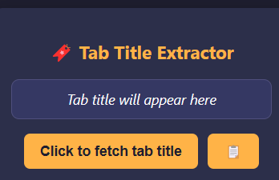

# Tab Title Fetcher

🎯 A lightweight Chrome/Opera extension that grabs the current tab's title and displays it in a sleek UI.

## Features

- Fetches tab title
- Copy to clipboard
- Minimal dark theme
- Clean UI

## Preview

## How to Install

1. Download the ZIP
2. Go to chrome://extensions
3. Enable Developer Mode
4. Load unpacked
